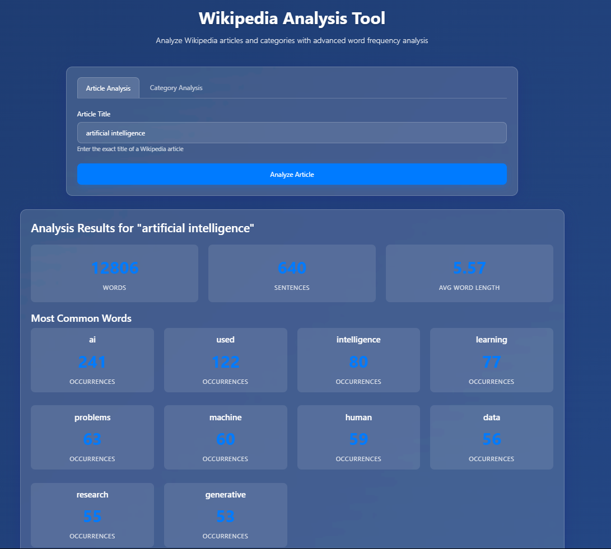
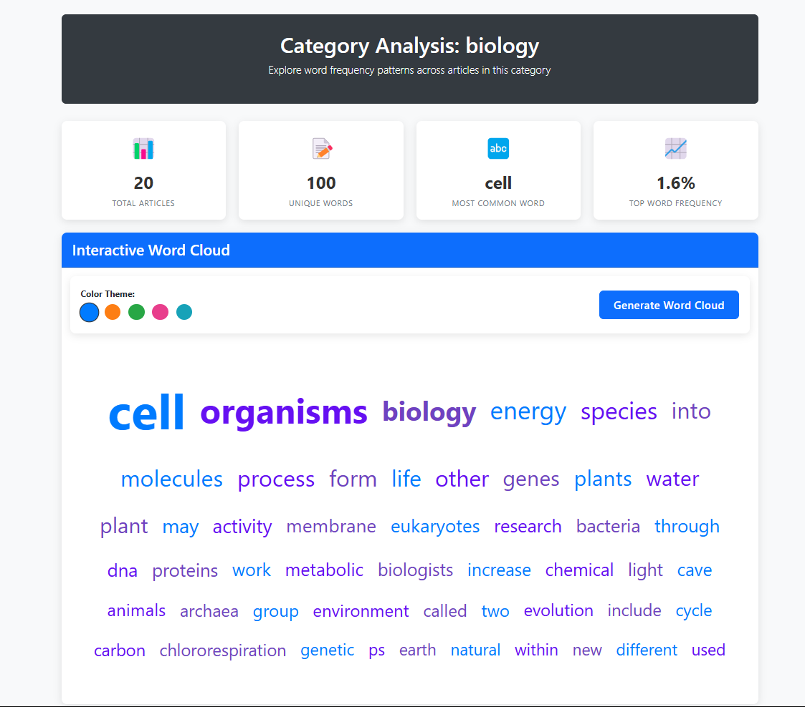

# Build Apps With Windsurf AI Coding agents 🌊

Some Examples of work outputted by windsurf Claude 3.7 Sonnet while working on the DeepLearning.ai course [Build Apps with Windsurf’s AI Coding Agents](https://www.deeplearning.ai/short-courses/build-apps-with-windsurfs-ai-coding-agents/?utm_campaign=codeium-launch&utm_medium=partner&utm_source=windsurf)
Instructor: Anshul Ramachandran
