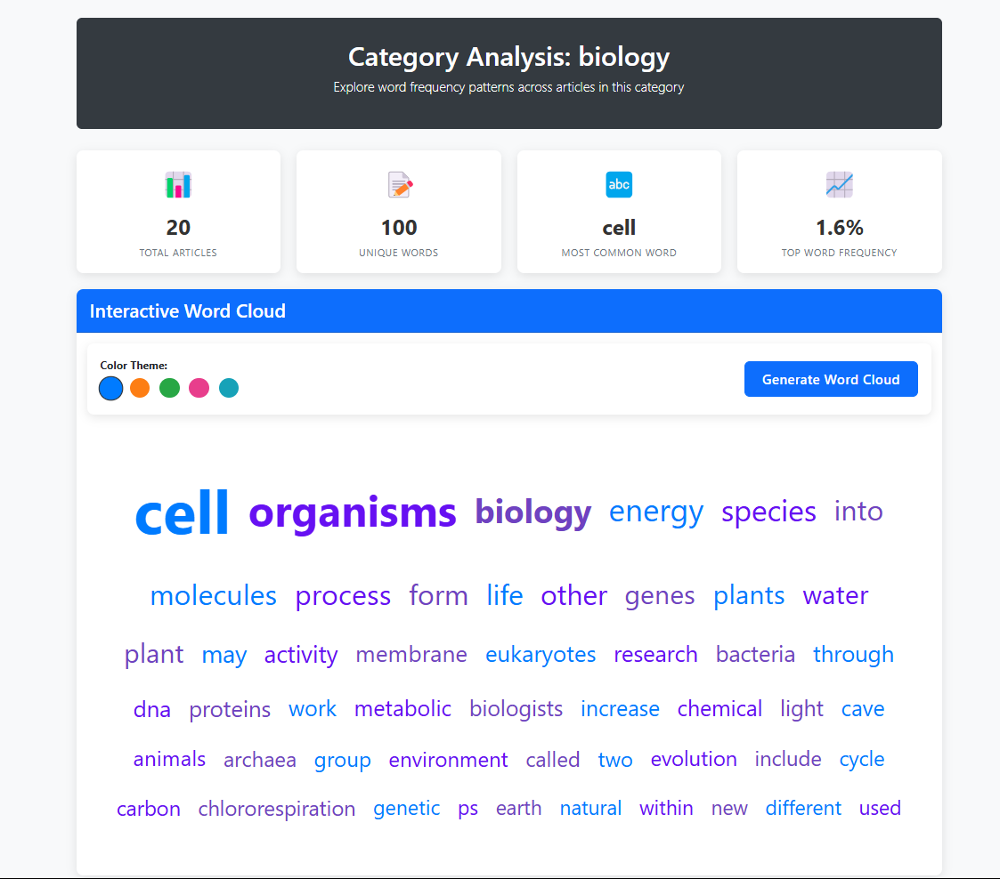

# 🧠 Wikipedia Article Analyzer

A simple **Flask** web application that fetches and analyzes Wikipedia articles using the **MediaWiki API**. The app provides key stats like word count, sentence count, average word length, and the most common words in a given article.



---

## 📦 Features

- Fetch content from any Wikipedia article by title
- Analyze text to show:
  - Total word count
  - Total sentence count
  - Average word length
  - Most common words
- Displays an excerpt from the article for quick reading

---

## 🚀 Getting Started

### Requirements

- Python 3.7+
- pip

### Installation

1. Cd to App Directory

```bash
cd example_2/wikipedia_analysis/
```

2. Create a virtual environment (optional but recommended):

   ```bash
   python3 -m venv venv
   source venv/bin/activate  # On Windows use venv\Scripts\activate
   ```

3. Install dependencies:

   ```bash
   pip install -r requirements.txt
   ```

4. Run the Flask app:

   ```bash
   python app.py
   ```

5. Open your browser and navigate to:

   ```
   http://localhost:5000
   ```

---

## 🧠 Usage

1. Enter a Wikipedia article title (e.g. `Large_language_models`)
2. Hit submit
3. View the analysis results and article excerpt

---

## 🧰 Tech Stack

- Flask
- Python
- MediaWiki API
- HTML/CSS (Jinja templates)

---

## 📁 Project Structure

```
wikipedia_analysis/
│
├── app.py                # Main Flask application
├── requirements.txt      # Python dependencies
└── templates/
    └── index.html        # UI template
```

---

## ⚠️ Notes

This project was originally intended to be a **Rust CLI app**, but was implemented as a **Flask web app** instead. If you'd like help rewriting this in Rust as a command-line tool, feel free to open an issue or contribute!

### Starting Prompt

Write a rust app that takes in a wikipedia category as a command line argument and outputs the cumulative frequency of non category and then run it on 'Large_languace_models' Use the MediaWiki API
use clean code
